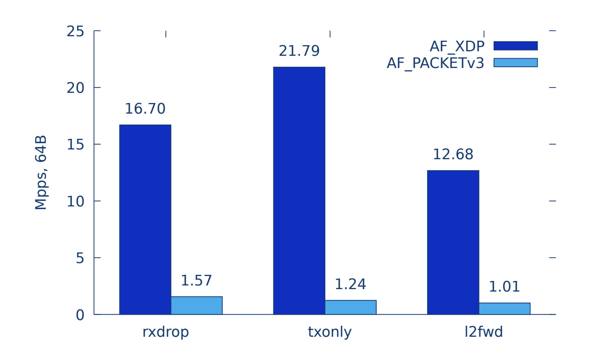
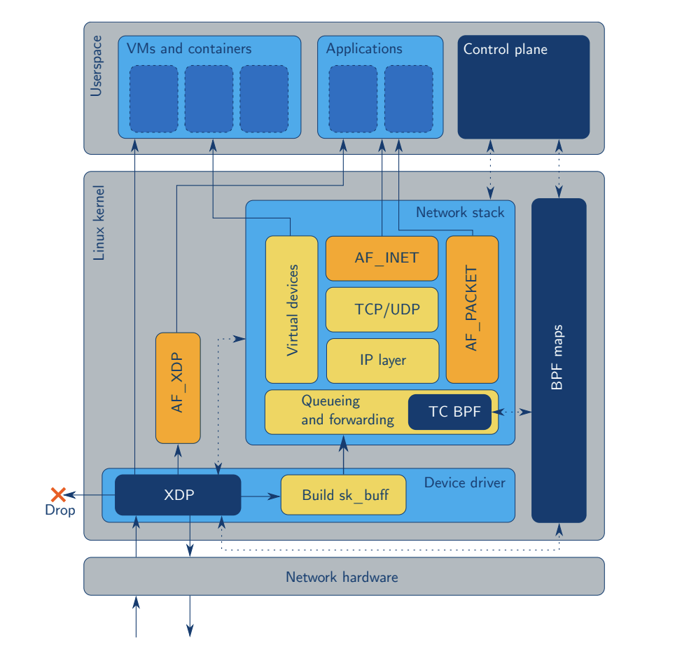
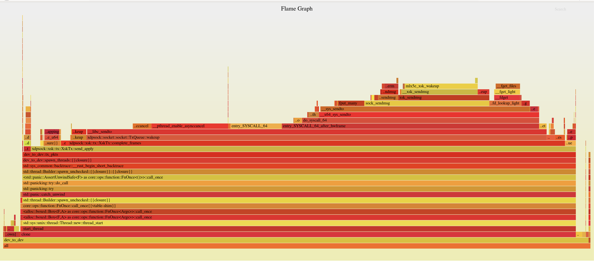

## Motivation
I'm interested in scanning the internet. That is, finding all hosts with a
specific port open, running a specific service, vulnerable to a certain
exploit, etc..

When scanning the internet, the question quickly arises: how
fast can I scan?  In order to scan quickly, we need to consider the method by
which we send and receive packets to and from the kernel.

## Fast Packet Processing
The are two main methods for fast packet processing:
- AF_PACKET, slow but easy to use
- Kernel Bypass (DPDK, Netmap, PF_RING), fast but hard to use

AF_XDP is a third way: an in-kernel fast path. It is nearly as fast as kernel bypass, but it is built
into the kernel.



Applications in which you might need high performance packet processing:
- Intrusion Detection, Ex. [Suricata](https://github.com/OISF/suricata)
- L4 Load Balancing, Ex [Katran](https://github.com/facebookincubator/katran)
- Quickly scanning the Internet, Ex. [ZMap](https://github.com/zmap/zmap)

ZMap already provides [high performance scanning using
PF_RING](https://github.com/zmap/zmap/blob/master/10gigE.md). However, to use
PF_RING, you have to buy [a license that costs $150 per network
interface](https://shop.ntop.org/). Since I'm too stingy to shell out for a
PF_RING license, I set out to use AF_XDP to send packets with ZMap.

## AF_XDP
AF_XDP is an address family that is optimized for high
performance packet processing. AF_XDP is built on top of two layers of abstraction

- eBPF: an in-kernel virtual machine which allows the user to load programs
  that respond events in certain kernel subsytems.


- XDP: an eBPF based networking fast path.



## AF_XDP and xdpsock

In order to use AF_XDP, you must set up shared data structures between your
userspace application and the kernel.

```
                      ┌───────────────────┐
                      │    UMEM Region    │
        TX            └───────────────────┘            RX
       Path            ┌────────────────┐             Path
                       │     Frame      │
                       │  Descriptors   │
     ┌────────┐       ┌┴────────────────┴─┐        ┌─────────┐
     │        │       │     Frame #0      │        │         │
     │        │       ├───────────────────┤        │         │
     │        │       │     Frame #1      │        │         │
     │TX Queue│◀──┐   ├───────────────────┤   ┌────│RX Queue │
     │        │   │   │                   │   │    │         │
     │        │   │   │         .         │   │    │         │
     │        │   │   │        ( )        │   │    │         │
     └────────┘   │   │         '         │◀──┘    └─────────┘
                  └───│                   │
                      │                   │
                  ┌──▶│         .         │───┐
    ┌──────────┐  │   │        ( )        │   │   ┌──────────┐
    │          │  │   │         '         │   │   │          │
    │          │  │   │                   │   │   │          │
    │Completion│  │   │                   │   │   │          │
    │  Queue   │──┘   │         .         │   └──▶│Fill Queue│
    │          │      │        ( )        │       │          │
    │          │      │         '         │       │          │
    │          │      ├───────────────────┤       │          │
    └──────────┘      │      Frame N      │       └──────────┘
                      └───────────────────┘
```

The UMEM region is a region of memory shared between userspace and the kernel.
It is broken up into frame descriptors, which have an address that is the
offset into the UMEM region. The kernel writes received packets to frame
descriptors, and the userspace application writes packets to transmit to frame
descriptors.

The TX/RX Queues and Completion/Fill Queues are used to transfer "ownership" of
frames between the userspace application and the kernel. The values that get
put onto these queues are Frame Descriptor addresses.

The TX Path: The userspace application writes packet data to a frame
descriptor, then puts the frame address on the TX Queue. The kernel puts frame
addresses on the Completion queue to indicate that the corresponding frame has
been successfully transmitted.

The RX Path: The userspace application puts frame addresses on the Fill Queue
in order to indicate to the kernel that the corresponding frames may be used to
receive packets. The kernel writes received packets to frame descriptors and
puts the frame addresses on the RX Queue.

## Rewrite it in Rust
First, I found this crate: [xsk-rs](https://github.com/DouglasGray/xsk-rs). The
author uses this crate for [C FFI to
libbpf](https://github.com/alexforster/libbpf-sys), which is used to set up the
shared queues. The provided examples are similar to the [af_xdp example in the
kernel source
tree](https://github.com/torvalds/linux/blob/master/samples/bpf/xdpsock_user.c).

This crate was super useful for getting started. However, there were two
problems for my use case:

- The design does not lend itself to sending and receiving from multiple
  threads, which is what we need in order to incorporate this into ZMap.
- The crate does not provide a simple API for sending a receiving packets.
  Users of the crate must manage the 4 queues themselves. We want a simple send
  bytes/receive bytes interface.

We will revisit the second problem in a moment. For now, let's tackle the
first. The relevant code looks something like this.

```
pub struct Umem<'a> {
    config: Config,
    frame_size: usize,
    umem_len: usize,
    mtu: usize,
    inner: Box<xsk_umem>,
    mmap_area: MmapArea,
    _marker: PhantomData<&'a ()>,
}

pub struct MmapArea {
    len: usize,
    mem_ptr: *mut libc::c_void,
}

pub struct FrameDesc<'umem> {
    addr: usize,
    len: usize,
    options: u32,
    _marker: PhantomData<&'umem ()>,
}

impl Umem<'_> {
...
    pub unsafe fn read_from_umem(&self, addr: &usize, len: &usize) -> &[u8] {
        self.mmap_area.mem_range(*addr, *len)
    }
...
    pub unsafe fn write_to_umem(&mut self, frame_desc: &mut FrameDesc, data: &[u8]) {
        let data_len = data.len();

        if data_len > 0 {
            let umem_region = self.mmap_area.mem_range_mut(&frame_desc.addr(), &data_len);

            umem_region[..data_len].copy_from_slice(data);
        }

        frame_desc.set_len(data_len);
    }
...
}
```

We can represent this with the following ownership diagram (Solid lines
represent ownership, dashed lines represent references).
```

      ┌────────────┐                               ┌─────────┐
      │            │                               │         │
      │            │                               │         │
      ├────────────┤                               │         │
      │            │                               │         │
      │            │                               │         │
      ├────────────┤                               │         │
      │            │                               │         │
      │            │                               │         │
      ├────────────┤          ┌──────────┐         │         │
      │            │          │          │         │         │
      │   Frame    │─ ─ ─ ─ ─▶│   UMEM   │────────▶│Mmap Area│
      │Descriptors │          │          │         │         │
      ├────────────┤          └──────────┘         │         │
      │            │                               │         │
      │            │                               │         │
      │            │                               │         │
      ├────────────┤                               │         │
      │            │                               │         │
      │            │                               │         │
      │            │                               │         │
      ├────────────┤                               │         │
      │            │                               └─────────┘
      │            │
      └────────────┘
```
All the writes to the UMEM region must go through this single Umem struct. We need a mutable reference to the Umem struct for the TX path. We can't share the Umem struct without wrapping it in a mutex, which would be likely be bad for performance.

This design isn't a problem in C. Since each write to portion of the Umem region goes through a frame descriptor, you could divy up the frame descriptors and hand them out to multiple threads, along with a pointer to the Umem region. If you did this correctly, you would be able to send and receive packets from multiple threads without data races.

However, this isn't going to work in Rust.
Instead, we want each frame to own it's portion of the Umem.
We would like the following ownership diagram:
```

  ┌────────────┐        ┌────────────┐
  │            ├────────▶            │
  │            │        │            │
  ├────────────┤        ├────────────┤
  │            ├────────▶            │
  │            │        │            │
  ├────────────┤        ├────────────┤
  │            ├────────▶            │
  │            │        │            │
  ├────────────┤        ├────────────┤
  │            │        │            │
  │   Frame    │        │            │
  │Descriptors │        │ Mmap Area  │
  ├────────────┤        ├────────────┤
  │            │        │            │
  │            ├────────▶            │
  │            │        │            │
  ├────────────┤        ├────────────┤
  │            │        │            │
  │            ├────────▶            │
  │            │        ├────────────┤
  ├────────────┤        │            │
  │            │        │            │
  │            ├────────▶            │
  └────────────┘        └────────────┘
```

## Unsafe Escape Hatch

I was unable to get this to work without resorting to unsafe. Instead, each frame holds an Arc to the Umem region and constructs it's corresponding slice of bytes using a call to `slice::from_raw_parts_mut`.

```
pub struct Frame<'umem> {
    addr: usize,
    len: usize,
    options: u32,
    mtu: usize,
    mmap_area: Arc<MmapArea>,
    pub status: FrameStatus,
}

impl Frame {
...
    pub unsafe fn read_from_umem(&self, len: usize) -> &[u8] {
        self.mmap_area.mem_range(self.addr, len)
    }
...

    pub unsafe fn write_to_umem(&mut self, data: &[u8]) {
        let data_len = data.len();

        if data_len > 0 {
            let umem_region = self.mmap_area.mem_range_mut(&self.addr(), &data_len);

            umem_region[..data_len].copy_from_slice(data);
        }

        self.set_len(data_len);
    }
...
}


pub struct MmapArea {
    len: usize,
    mem_ptr: *mut libc::c_void,
}
impl MmapArea {
...
    pub unsafe fn mem_range_mut(&self, offset: &usize, len: &usize) -> &mut [u8] {
        let ptr = self.mem_ptr.offset((*offset).try_into().unwrap());

        slice::from_raw_parts_mut(ptr as *mut u8, *len)
    }
...
}
```

## Performance

After fixing the design issue, I wrote some logic to manage the queues and
provided a send/recv interface, which looks like this:
```
// Sending a packet
let pkt: Vec<u8> = vec![];
xsk.tx.send(&pkt);

// Receiving a packet
let pkt: Vec<u8> = vec![];
let len = xsk.recv(&mut pkt);
```

However, at this point I was only getting about 5 million packets per second on
a 10Gb link. The ZMap authors claim they are able to achieve 14 million packets
per second on a 10Gb link.

### Optimizing TX
Flamegraphs are a tool to visualize where your program is spending time.
[cargo-flamegraph](https://github.com/flamegraph-rs/flamegraph)



The send method calls the complete frames method.
```
    pub fn send(&mut self, data: &[u8]) -> Result<(), XskSendError> {
        log::debug!("tx: tx_cursor = {}", self.tx_cursor);

        self.complete_frames();

        if !self.tx_frames[self.tx_cursor].status.is_free() {
            return Err(XskSendError::NoFreeTxFrames);
        }

        unsafe {
            self.tx_frames[self.tx_cursor]
                .write_to_umem_checked(data)
                .expect("failed to write to umem");
        }

        self.tx_cursor = (self.tx_cursor + 1) % self.tx_frames.len();
        self.cur_batch_size += 1;

        log::debug!(
            "tx: cur_batch_size = {}, batch_size = {}",
            self.cur_batch_size,
            self.batch_size
        );

        // Add consumed frames back to the tx queue
        if self.cur_batch_size == self.batch_size {
            self.put_batch_on_tx_queue();
        }

        Ok(())
    }
```

put_batch_on_tx_queue

```
    fn put_batch_on_tx_queue(&mut self) {
        log::debug!(
            "tx: putting batch on queue: batch_size = {}, tx_cursor = {}",
            self.batch_size,
            self.tx_cursor
        );
        if self.cur_batch_size == 0 {
            return;
        }

        let mut start = self.tx_cursor - self.cur_batch_size;
        let mut end = self.tx_cursor;
        if self.tx_cursor == 0 {
            start = self.tx_frames.len() - self.cur_batch_size;
            end = self.tx_frames.len();
        }
        log::debug!("tx: adding tx_frames[{}..{}] to tx queue", start, end);

        for frame in self.tx_frames[start..end].iter_mut() {
            frame.status = FrameStatus::OnTxQueue;
        }

        while unsafe {
            self.tx_q
                .produce_and_wakeup(&self.tx_frames[start..end])
                .expect("failed to add frames to tx queue")
        } != self.cur_batch_size
        {
            // Loop until frames added to the tx ring.
            log::debug!(
                "tx_q.produce_and_wakeup() failed to allocate {} frame",
                self.cur_batch_size
            );
        }
        log::debug!("tx_q.produce_and_wakeup() submitted {} frames", 1);

        self.stats.pkts_tx += self.cur_batch_size as u64;
        self.outstanding_tx_frames += self.cur_batch_size as u64;
        self.cur_batch_size = 0;
    }
```

This is the complete frames method:
```

    /// Read frames from completion queue
    fn complete_frames(&mut self) -> u64 {
        log::debug!("tx: reading from completion queue");
        let n_free_frames = self
            .comp_q
            .consume(self.outstanding_tx_frames, &mut self.free_frames);
        self.outstanding_tx_frames -= n_free_frames;

        self.stats.pkts_tx_completed += n_free_frames;

        if n_free_frames == 0 {
            log::debug!("comp_q.consume() consumed 0 frames");
            if self.tx_q.needs_wakeup() {
                log::debug!("tx: waking up tx_q");
                self.tx_q.wakeup().expect("failed to wake up tx queue");
                log::debug!("tx: woke up tx_q");
            }
        }
        log::debug!("tx: comp_q.consume() consumed {} frames", n_free_frames);

        self.update_tx_frames(n_free_frames as usize);
        n_free_frames
    }
```

We are waking the kernel up twice per send call, once in the send method when
we call produce_and_wakeup, and once in the complete frames method. Getting rid
of this extra call in the complete_frames method gives us the 14 million
packets per second that we're after.


### Optimizing RX
Now that we have optimized the TX path, we have a new problem: the RX path
can't keep up. My first attempt at the receive function looked something like
this:
```
    pub fn recv(&mut self, pkt_receiver: &mut [u8]) -> usize {
```
This method receives a packet on the RX Queue and copies it into the
pkt_receiver slice. There are two problems from this from a performance
perspective:
- We are doing an additional copy for each packet received.
- When we read from the RX queue, we might read multiple packets. However, each
  call to `recv` only handles one packet. If the received packets are grouping
  together due to the sender sending batches or traffic shaping of a network
  device, we will fall behind.

Thankfully, we can use a closure to operate on the received packet in place.
```
    pub fn recv_apply<F>(&mut self, f: F)
    where
        F: FnMut(&[u8]),
    {
    ...
        if n_frames_recv > 0 {
            self.apply_batch(n_frames_recv, f);
        }
    ...
    }

    fn apply_batch<F>(&mut self, n_frames_recv: usize, mut f: F)
    where
        F: FnMut(&[u8]),
    {
    ...

        for filled_frame in filled_frames {

            let data = unsafe { filled_frame.read_from_umem(frame.len()) };
            f(data);
        }
    ...
    }
```
This solves both problems outlined above.

## C FFI
[The Rust FFI Omnibus](http://jakegoulding.com/rust-ffi-omnibus/)
