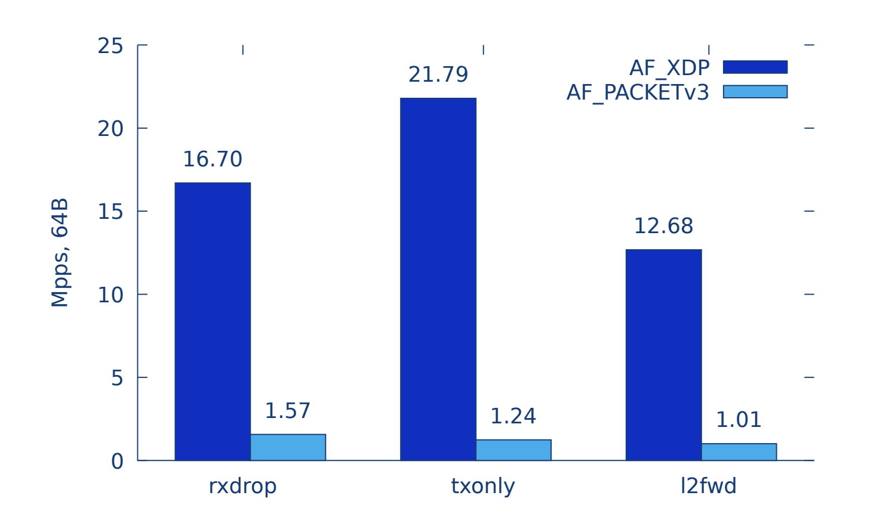
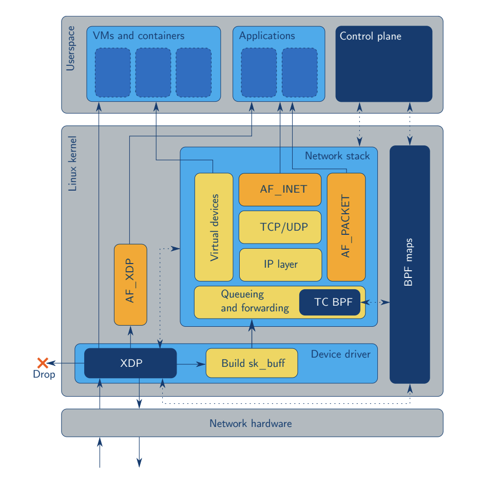
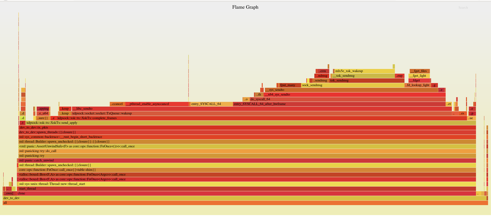
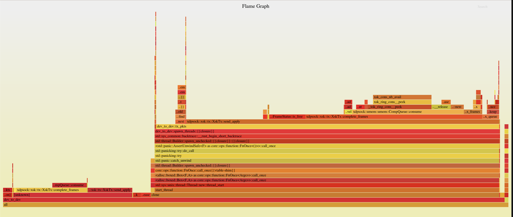

## Motivation
I'm interested in scanning the internet as fast as possible.

- There are 4,294,967,296 IPv4 Addresses
- Scanning all of IPv4 at 100,000 packets per second takes 12 hours
- Scanning all of IPv4 at 1,000,000 per second takes 71 minutes
- Scanning all of IPv4 at 10,000,000 packets per second takes 7 minutes

## OS/Kernel Review
\tiny
```
    ┌──────────────────────────────────────────────┐
    │                  Userspace                   │
    └──────────────────────────────────────────────┘

  ┌──────────────┐  ┌──────────────┐  ┌──────────────┐
  │ Application  │  │ Application  │  │ Application  │
  │ (Ex. Chrome) │  │ (Ex. Photos) │  │(Ex. Terminal)│
  └──────────────┘  └──────────────┘  └──────────────┘
          │                 │                 │
          │                 │                 │
─ ─ ─ Syscall ─ ─ ─ ─ ─ Syscall ─ ─ ─ ─ ─ Syscall ─ ─ ─ ─
          │                 │                 │
          ▼                 ▼                 ▼
    ┌──────────────────────────────────────────────┐
    │                    Kernel                    │
    └──────┬─────────────────────────────────┬─────┘
           │                │                │
           │                │                │
           │                │                │
           ▼                ▼                ▼
    ┌──────────────┐   ┌───────────┐   ┌───────────┐
    │   Network    │   │ Hardrive  │   │    RAM    │
    │Interface Card│   │           │   │           │
    └──────────────┘   └───────────┘   └───────────┘
```
\normalsize


## Fast Packet Processing
The are two main methods for fast packet processing:

- In-Kernel: AF_PACKET, in kernel, slow but easy to use
- Kernel Bypass (DPDK, Netmap, PF_RING), fast but hard to use

## AF_XDP
AF_XDP is a third way: an in-kernel fast path. It is nearly as fast as kernel bypass, but it is built
into the kernel.



## Analogy
Imagine going to the airport

- In-Kernel packet processing is like going through TSA
- Kernel bypass is like showing up to the airport and getting on a private jet
- AF_XDP is like TSA Precheck

## Applications
Applications in which you might need high performance packet processing:

- Intrusion Detection, Ex. [Suricata](https://github.com/OISF/suricata)
- L4 Load Balancing, Ex [Katran](https://github.com/facebookincubator/katran)
- Quickly scanning the Internet, Ex. [ZMap](https://github.com/zmap/zmap)

## Zmap

\small
```
   ┌─────────┐                 ┌─────────┐
   │ Client  │                 │ Server  │
   └─────────┘                 └─────────┘
        │                           │    ┌────────────┐
        │────────────SYN───────────▶│    │ Packet #0  │
        │                           │    └────────────┘
        │                           │
        │                           │    ┌────────────┐
        │◀──────────SYNACK──────────│    │ Packet #1  │
        │                           │    └────────────┘
        │                           │
        │                           │    ┌────────────┐
        │────────────ACK───────────▶│    │ Packet #2  │
        │                           │    └────────────┘
        │                           │
        │                           │    ┌────────────┐
        ├────────────Data──────────▶│    │ Packet #3  │
        │                           │    └────────────┘
```
\normalsize

## Zmap
Sends TCP SYN packets, listens for SYNACK to determine open ports.

## Zmap
ZMap already provides [high performance scanning using
PF_RING](https://github.com/zmap/zmap/blob/master/10gigE.md).

However, to use PF_RING, you have to buy [a license that costs $150 per network
interface](https://shop.ntop.org/).

Since I'm too stingy to shell out for a PF_RING license, I set out to use
AF_XDP to send packets with ZMap.

## AF_XDP
AF_XDP is an address family that is optimized for high
performance packet processing. AF_XDP is built on top of two layers of abstraction
- eBPF
- XDP

{ height=256px }


## AF_XDP and xdpsock
\tiny
```
                      ┌───────────────────┐
                      │    UMEM Region    │
        TX            └───────────────────┘            RX
       Path            ┌────────────────┐             Path
                       │     Frame      │
                       │  Descriptors   │
     ┌────────┐       ┌┴────────────────┴─┐        ┌─────────┐
     │        │       │     Frame #0      │        │         │
     │        │       ├───────────────────┤        │         │
     │        │       │     Frame #1      │        │         │
     │TX Queue│◀──┐   ├───────────────────┤   ┌────│RX Queue │
     │        │   │   │                   │   │    │         │
     │        │   │   │         .         │   │    │         │
     │        │   │   │        ( )        │   │    │         │
     └────────┘   │   │         '         │◀──┘    └─────────┘
                  └───│                   │
                      │                   │
                  ┌──▶│         .         │───┐
    ┌──────────┐  │   │        ( )        │   │   ┌──────────┐
    │          │  │   │         '         │   │   │          │
    │          │  │   │                   │   │   │          │
    │Completion│  │   │                   │   │   │          │
    │  Queue   │──┘   │         .         │   └──▶│Fill Queue│
    │          │      │        ( )        │       │          │
    │          │      │         '         │       │          │
    │          │      ├───────────────────┤       │          │
    └──────────┘      │      Frame N      │       └──────────┘
                      └───────────────────┘
```
\normalsize


## Rewrite it in Rust
Starting point: [https://github.com/DouglasGray/xsk-rs](https://github.com/DouglasGray/xsk-rs).

Similar to the [af_xdp example in the kernel source
tree](https://github.com/torvalds/linux/blob/master/samples/bpf/xdpsock_user.c).

Uses [https://github.com/alexforster/libbpf-sys](https://github.com/alexforster/libbpf-sys), which is used to set up the shared queues.

## Issues
Two problems for my use case:

- Can't send and receive from multiple threads
- Complicated API

## Design Issue
Original Design
\small
```
pub struct Umem<'a> {
    config: Config,
    frame_size: usize,
    umem_len: usize,
    mtu: usize,
    inner: Box<xsk_umem>,
    mmap_area: MmapArea,
    _marker: PhantomData<&'a ()>,
}

impl Umem<'a_> {
    pub unsafe fn read_from_umem(&self, addr: &usize, len: &usize) -> &[u8]

    pub unsafe fn write_to_umem(&mut self,
        frame_desc: &mut FrameDesc, data: &[u8])
}
```
\normalsize

## Ownership Diagram
We can represent this with the following ownership diagram (Solid lines
represent ownership, dashed lines represent references).
\tiny
```

      ┌────────────┐                               ┌─────────┐
      │            │                               │         │
      │            │                               │         │
      ├────────────┤                               │         │
      │            │                               │         │
      │            │                               │         │
      ├────────────┤                               │         │
      │            │                               │         │
      │            │                               │         │
      ├────────────┤          ┌──────────┐         │         │
      │            │          │          │         │         │
      │   Frame    │─ ─ ─ ─ ─▶│   UMEM   │────────▶│Mmap Area│
      │Descriptors │          │          │         │         │
      ├────────────┤          └──────────┘         │         │
      │            │                               │         │
      │            │                               │         │
      │            │                               │         │
      ├────────────┤                               │         │
      │            │                               │         │
      │            │                               │         │
      │            │                               │         │
      ├────────────┤                               │         │
      │            │                               └─────────┘
      │            │
      └────────────┘
```
\normalsize

## Revised Ownership Diagram
\tiny
```

  ┌────────────┐        ┌────────────┐
  │            ├────────▶            │
  │            │        │            │
  ├────────────┤        ├────────────┤
  │            ├────────▶            │
  │            │        │            │
  ├────────────┤        ├────────────┤
  │            ├────────▶            │
  │            │        │            │
  ├────────────┤        ├────────────┤
  │            │        │            │
  │   Frame    │        │            │
  │Descriptors │        │ Mmap Area  │
  ├────────────┤        ├────────────┤
  │            │        │            │
  │            ├────────▶            │
  │            │        │            │
  ├────────────┤        ├────────────┤
  │            │        │            │
  │            ├────────▶            │
  │            │        ├────────────┤
  ├────────────┤        │            │
  │            │        │            │
  │            ├────────▶            │
  └────────────┘        └────────────┘
```
\normalsize

## Unsafe Escape Hatch

\small
```
pub struct Frame<'umem> {
    addr: usize,
    len: usize,
    options: u32,
    mtu: usize,
    mmap_area: Arc<MmapArea>,
    pub status: FrameStatus,
}
```
\normalsize

## Unsafe Escape Hatch
\small
```
impl Frame {
...
    pub unsafe fn read_from_umem(&self, len: usize) -> &[u8] {
        self.mmap_area.mem_range(self.addr, len)
    }

```
\normalsize

## Unsafe Escape Hatch
\small
```
...

pub unsafe fn write_to_umem(&mut self, data: &[u8]) {
    let data_len = data.len();

    if data_len > 0 {
        let umem_region = self.mmap_area.mem_range_mut(&self.addr(), &data_len);

        umem_region[..data_len].copy_from_slice(data);
    }

    self.set_len(data_len);
}
...
}
```
\normalsize

## Simplifying the API

```
// Sending a packet
let pkt: Vec<u8> = vec![];
xsk.tx.send(&pkt);

// Receiving a packet
let pkt: Vec<u8> = vec![];
let len = xsk.recv(&mut pkt);
```

## Performance Test Setup

\tiny
https://github.com/seeyarh/xdpsock/blob/master/examples/dev_to_dev.rs
\tiny
```

  ┌───────────────────────┐                 ┌───────────────────────┐
  │                       │                 │                       │
  │                       │                 │                       │
  │                       │                 │                       │
  │       TX Server       │                 │       RX Server       │
  │                       │─────────────────▶                       │
  │                       │                 │                       │
  │                       │                 │                       │
  │                       │                 │                       │
  └───────────────────────┘                 └───────────────────────┘
```
\normalsize
## Performance

Too slow

Should be able to get 14 million pps, only getting 5 million pps

## Optimizing TX
Flamegraphs are a tool to visualize where your program is spending time.
[cargo-flamegraph](https://github.com/flamegraph-rs/flamegraph)



## Send method unoptimized
The send method calls the complete frames method.
\small
```
    pub fn send(&mut self, data: &[u8])
        -> Result<(), XskSendError> {
        self.complete_frames();
        ...

        // Add consumed frames back to the tx queue
        if self.cur_batch_size == self.batch_size {
            self.put_batch_on_tx_queue();
        }

        Ok(())
    }
```
## Send method unoptimized

```
    fn put_batch_on_tx_queue(&mut self) {
    ...
        while unsafe {
            self.tx_q
                .produce_and_wakeup(&self.tx_frames[start..end])
                .expect("failed to add frames to tx queue")
        } != self.cur_batch_size
        {
            // Loop until frames added to the tx ring.
        }
    ...
    }
```

## Send method unoptimized

```

    /// Read frames from completion queue
    fn complete_frames(&mut self) -> u64 {
        ...
        if n_free_frames == 0 {
            log::debug!("comp_q.consume() consumed 0 frames");
            if self.tx_q.needs_wakeup() {
                self.tx_q.wakeup()
                    .expect("failed to wake up tx queue");
            }
        }
        ...
    }
```
\normalsize

## Optimizing TX


## Optimizing RX
Now that we have optimized the TX path, we have a new problem: the RX path
can't keep up.

## Optimizing RX

\small
```
    pub fn recv(&mut self, pkt_receiver: &mut [u8]) -> usize {
```
\normalsize

## Optimizing RX - Copy

\tiny
```
       ┌────────────────┐                ┌──────────────────────┐
       │    xdpsock     │         │      │Library User, Ex ZMap │
       └────────────────┘                └──────────────────────┘
                                  │
   ┌────────────────────────┐           ┌────────────────────────┐
   │                        │     │     │                        │
   │                        │           │                        │
   │      Packet Data       │───Copy───▶│      Packet Data       │
   │                        │           │                        │
   │                        │     │     │                        │
   └────────────────────────┘           └────────────▲───────────┘
                                  │                  │

                                  │                  │

                                  │                  │
                                          ┌─────────────────────┐
                                  │       │                     │
                                          │     User Parser     │
                                  │       │                     │
                                          └─────────────────────┘
                                  │
```
\normalsize
## Optimizing RX - Zerocopy
Accept a function, use a closure

## Optimizing RX - Zerocopy
\tiny
```

      ┌────────────────┐                ┌──────────────────────┐
      │    xdpsock     │         │      │Library User, Ex ZMap │
      └────────────────┘                └──────────────────────┘
                                 │
  ┌────────────────────────┐
  │                        │     │       ┌─────────────────────┐
  │                        │             │                     │
  │      Packet Data       │◀ ─ ─│─ ─ ─ ─│     User Parser     │
  │                        │             │                     │
  │                        │     │       └─────────────────────┘
  └────────────────────────┘
                                 │

                                 │
```


## Optimizing RX: avoiding copies
\small
```
pub fn recv_apply<F>(&mut self, f: F)
where
    F: FnMut(&[u8]),
{
...
    if n_frames_recv > 0 {
        self.apply_batch(n_frames_recv, f);
    }
...
}
```
\normalsize

## Optimizing RX: avoiding copies
\small
```
fn apply_batch<F>(&mut self, n_frames_recv: usize, mut f: F)
where
    F: FnMut(&[u8]),
{
...

    for filled_frame in filled_frames {

        let data = unsafe { filled_frame.read_from_umem(frame.len()) };
        f(data);
    }
...
}
```
\normalsize

## C FFI
[The Rust FFI Omnibus](http://jakegoulding.com/rust-ffi-omnibus/)

## C FFI
\small
```
#[no_mangle]
pub extern "C" fn xsk_new<'a>(ifname: *const c_char) -> *mut Xsk2<'a> {
    let ifname = unsafe {
        assert!(!ifname.is_null());
        CStr::from_ptr(ifname)
    };

    let ifname = ifname.to_str().unwrap();

    let mut xsk = Xsk2::new(&ifname, 0,
        umem_config, socket_config, n_tx_frames as usize);

    Box::into_raw(Box::new(xsk))
}
```

## C FFI
\small
```
#[no_mangle]
pub extern "C" fn xsk_send(xsk_ptr: *mut Xsk2,
    pkt: *const u8, len: size_t) {

    let xsk = unsafe {
        assert!(!xsk_ptr.is_null());
        &mut *xsk_ptr
    };

    let pkt = unsafe {
        assert!(!pkt.is_null());
        slice::from_raw_parts(pkt, len as usize)
    };

    xsk.send(&pkt);
}
```

## C FFI
\small
```
#[no_mangle]
pub extern "C" fn xsk_recv(xsk_ptr: *mut Xsk2,
    pkt: *mut u8, len: size_t) {

    let xsk = unsafe {
        assert!(!xsk_ptr.is_null());
        &mut *xsk_ptr
    };

    let mut pkt = unsafe {
        assert!(!pkt.is_null());
        slice::from_raw_parts_mut(pkt, len as usize)
    };

    let (recvd_pkt, len) = xsk.recv().expect("failed to recv");
    pkt[..len].clone_from_slice(&recvd_pkt[..len]);
}
```
## C FFI
\small
```
char* ifname = "veth0";
void* xsk = xsk_new(ifname);
...

for(i = 0; i < pkts_to_recv; i++) {
    char buf[MAX_PKT_SIZE] = {0};
    xsk_recv(xsk, &buf, len);
}


...

for(i = 0; i < pkts_to_send; i++) {
    xsk_send(xsk, &pkt_to_send, 50);
}

...
xsk_delete(xsk);
```
