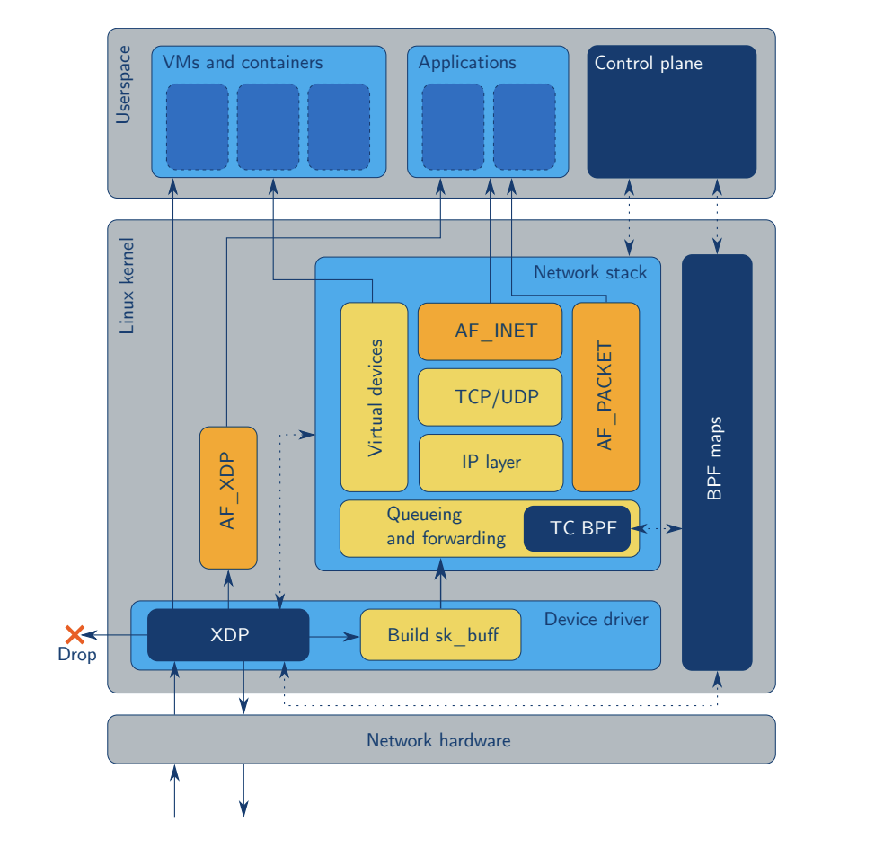
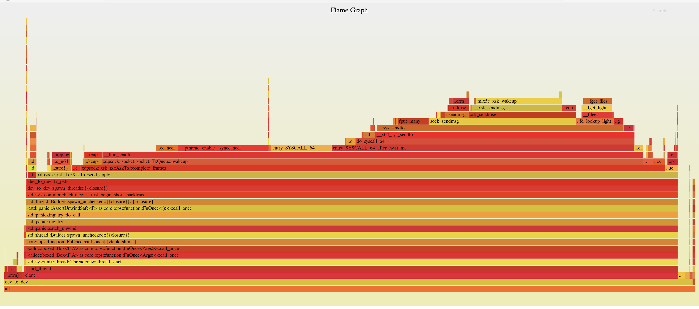

## Motivation
I'm interested in scanning the internet. That is, finding all hosts with a
specific port open, running a specific service, vulnerable to a certain
exploit, etc..

Finding open ports is the first step in scanning the internet.

When you want to run a service (webserver, irc server, ftp server) that other people on the internet can connect to as clients, you need two things: an IP address and an open port.

An IP address uniquely a machine on the internet (home address). A port
identifies a service running on that machine. Ports are assigned to different
services. HTTP runs on port 80, HTTPS on port 443, SSH on port 22.

To find open ports, we need to know a little bit about how TCP works.


TCP is a reliable transport layer protocol. It begins with a three way handshake:

```
   ┌─────────┐                 ┌─────────┐
   │ Client  │                 │ Server  │
   └─────────┘                 └─────────┘
        │                           │    ┌────────────┐
        │────────────SYN───────────▶│    │ Packet #0  │
        │                           │    └────────────┘
        │                           │
        │                           │    ┌────────────┐
        │◀──────────SYNACK──────────│    │ Packet #1  │
        │                           │    └────────────┘
        │                           │
        │                           │    ┌────────────┐
        │────────────ACK───────────▶│    │ Packet #2  │
        │                           │    └────────────┘
        │                           │
        │                           │    ┌────────────┐
        ├────────────Data──────────▶│    │ Packet #3  │
        │                           │    └────────────┘
```

The tool of choice for quickly finding all open ports on a bunch of IP addresses is ZMap. ZMap operates by sending SYN packets and listening for SYNACK packets to determine open ports.

When scanning the internet, speed matters.
- There are 4,294,967,296 IPv4 Addresses
- Scanning all of IPv4 at 100,000 packets per second takes 12 hours
- Scanning all of IPv4 at 1,000,000 per second takes 71 minutes
- Scanning all of IPv4 at 10,000,000 packets per second takes 7 minutes


In order to scan quickly, we need to consider the method by
which we send and receive packets to and from the kernel.

## OS/Kernel Review
Usually, when sending or receiving packets, we interact with our network hardware through the OS kernel via system calls

As a client, we call socket, connect to connect to a remote server.

https://man7.org/linux/man-pages/man2/socket.2.html

https://man7.org/linux/man-pages/man2/bind.2.html

https://man7.org/linux/man-pages/man2/connect.2.html

https://man7.org/linux/man-pages/man2/recvfrom.2.html

https://man7.org/linux/man-pages/man2/send.2.html

```
    ┌──────────────────────────────────────────────┐
    │                  Userspace                   │
    └──────────────────────────────────────────────┘

  ┌──────────────┐  ┌──────────────┐  ┌──────────────┐
  │ Application  │  │ Application  │  │ Application  │
  │ (Ex. Chrome) │  │ (Ex. Photos) │  │(Ex. Terminal)│
  └──────────────┘  └──────────────┘  └──────────────┘
          │                 │                 │
          │                 │                 │
─ ─ ─ Syscall ─ ─ ─ ─ ─ Syscall ─ ─ ─ ─ ─ Syscall ─ ─ ─ ─
          │                 │                 │
          ▼                 ▼                 ▼
    ┌──────────────────────────────────────────────┐
    │                    Kernel                    │
    └──────┬─────────────────────────────────┬─────┘
           │                │                │
           │                │                │
           │                │                │
           ▼                ▼                ▼
    ┌──────────────┐   ┌───────────┐   ┌───────────┐
    │   Network    │   │ Hardrive  │   │    RAM    │
    │Interface Card│   │           │   │           │
    └──────────────┘   └───────────┘   └───────────┘
```

If we want to go faster, we have to use different methods.


## Fast Packet Processing
The are two main methods for fast packet processing:

AF_PACKET as an address family that gives the userspace application access to raw ethernet frames. This avoids the overhead of maintaining state for TCP connections. However, there is still overhead from the socket buffer and traffic control components, making system calls that copy packets from userspace to the kernel.

Kernel Bypass (DPDK, Netmap, PF_RING) techniques give the userspace appliation
direct access to the NIC. These methods can send and receive packets very
quickly. However, they are more difficult to use as you must load a kernel
module in order to bypass the kernel networking stack.

## Zmap
ZMap uses AF_PACKET by default, and gives the user the option to use PF_RING
for [high performance scanning
](https://github.com/zmap/zmap/blob/master/10gigE.md).

However, to use PF_RING, you have to buy [a license that costs $150 per network
interface](https://shop.ntop.org/).

Since I'm too stingy to shell out for a PF_RING license, I set out to find another way.

## AF_XDP
[AF_XDP](https://www.kernel.org/doc/html/latest/networking/af_xdp.html) is a third way: an in-kernel fast path. It is nearly as fast as kernel bypass, but it is built
into the kernel.


## Zmap
ZMap already provides [high performance scanning using
PF_RING](https://github.com/zmap/zmap/blob/master/10gigE.md).

However, to use PF_RING, you have to buy [a license that costs $150 per network
interface](https://shop.ntop.org/).

Since I'm too stingy to shell out for a PF_RING license, I set out to use
AF_XDP to send packets with ZMap.

## AF_XDP
AF_XDP is an address family that is optimized for high
performance packet processing. AF_XDP is built on top of two layers of abstraction

## eBPF
eBPF: an in-kernel virtual machine which allows the user to load programs
  that respond events in certain kernel subsytems.


## XDP
XDP: an eBPF based networking fast path.



## AF_XDP

In order to use AF_XDP, you must set up shared data structures between your
userspace application and the kernel.

## AF_XDP components
- 2 queues for TX: the TX Queue and Completion Queue
- 2 queues for RX: the RX Queue and Fill Queue
- 1 region of memory called the UMEM, shared between userspace and the kernel.

## UMEM and MMAP
We need to allocate a big block of memory to use AF_XDP. Can't allocate this on
the stack as it would be too big. We don't want to allocate this on the heap as
it would lead to fragmentation. The best way to do this is with mmap.

https://man7.org/linux/man-pages/man2/mmap.2.html

mmap() creates a new mapping in the virtual address space of the calling process.

Usually, mmap() is used to map a file into memory, so that the file contents can be manipulated as if they were memory locations.

MAP_ANONYMOUS:
The mapping is not backed by any file; its contents are
initialized to zero.

MMAP_ANONYMOUS gives us a big block of memory, separate from the stack and
heap, that we can use for any purpose.

## AF_XDP and xdpsock
\tiny
```
                      ┌───────────────────┐
                      │    UMEM Region    │
        TX            └───────────────────┘            RX
       Path            ┌────────────────┐             Path
                       │     Frame      │
                       │  Descriptors   │
     ┌────────┐       ┌┴────────────────┴─┐        ┌─────────┐
     │        │       │     Frame #0      │        │         │
     │        │       ├───────────────────┤        │         │
     │        │       │     Frame #1      │        │         │
     │TX Queue│◀──┐   ├───────────────────┤   ┌────│RX Queue │
     │        │   │   │                   │   │    │         │
     │        │   │   │         .         │   │    │         │
     │        │   │   │        ( )        │   │    │         │
     └────────┘   │   │         '         │◀──┘    └─────────┘
                  └───│                   │
                      │                   │
                  ┌──▶│         .         │───┐
    ┌──────────┐  │   │        ( )        │   │   ┌──────────┐
    │          │  │   │         '         │   │   │          │
    │          │  │   │                   │   │   │          │
    │Completion│  │   │                   │   │   │          │
    │  Queue   │──┘   │         .         │   └──▶│Fill Queue│
    │          │      │        ( )        │       │          │
    │          │      │         '         │       │          │
    │          │      ├───────────────────┤       │          │
    └──────────┘      │      Frame N      │       └──────────┘
                      └───────────────────┘
```
\normalsize

## AF_XDP and xdpsock

The UMEM region is a region of memory shared between userspace and the kernel.
It is broken up into frame descriptors, which have an address that is the
offset into the UMEM region. The kernel writes received packets to frame
descriptors, and the userspace application writes packets to transmit to frame
descriptors.

The TX/RX Queues and Completion/Fill Queues are used to transfer "ownership" of
frames between the userspace application and the kernel. The values that get
put onto these queues are Frame Descriptor addresses.

The TX Path: The userspace application writes packet data to a frame
descriptor, then puts the frame address on the TX Queue. The kernel puts frame
addresses on the Completion queue to indicate that the corresponding frame has
been successfully transmitted.

The RX Path: The userspace application puts frame addresses on the Fill Queue
in order to indicate to the kernel that the corresponding frames may be used to
receive packets. The kernel writes received packets to frame descriptors and
puts the frame addresses on the RX Queue.

## Rewrite it in Rust
First, I found this crate: [xsk-rs](https://github.com/DouglasGray/xsk-rs). The
author uses this crate for [C FFI to
libbpf](https://github.com/alexforster/libbpf-sys), which is used to set up the
shared queues. The provided examples are similar to the [af_xdp example in the
kernel source
tree](https://github.com/torvalds/linux/blob/master/samples/bpf/xdpsock_user.c).

This crate was super useful for getting started. However, there were two
problems for my use case:

- The design does not lend itself to sending and receiving from multiple
  threads, which is what we need in order to incorporate this into ZMap.
- The crate does not provide a simple API for sending a receiving packets.
  Users of the crate must manage the 4 queues themselves. We want a simple send
  bytes/receive bytes interface.

We will revisit the second problem in a moment. For now, let's tackle the
first. The relevant code looks something like this.

```
pub struct Umem<'a> {
    config: Config,
    frame_size: usize,
    umem_len: usize,
    mtu: usize,
    inner: Box<xsk_umem>,
    mmap_area: MmapArea,
    _marker: PhantomData<&'a ()>,
}

pub struct MmapArea {
    len: usize,
    mem_ptr: *mut libc::c_void,
}

pub struct FrameDesc<'umem> {
    addr: usize,
    len: usize,
    options: u32,
    _marker: PhantomData<&'umem ()>,
}

impl Umem<'_> {
...
    pub unsafe fn read_from_umem(&self, addr: &usize, len: &usize) -> &[u8] {
        self.mmap_area.mem_range(*addr, *len)
    }
...
    pub unsafe fn write_to_umem(&mut self, frame_desc: &mut FrameDesc, data: &[u8]) {
        let data_len = data.len();

        if data_len > 0 {
            let umem_region = self.mmap_area.mem_range_mut(&frame_desc.addr(), &data_len);

            umem_region[..data_len].copy_from_slice(data);
        }

        frame_desc.set_len(data_len);
    }
...
}
```

## Ownership Diagram
We can represent this with the following ownership diagram (Solid lines
represent ownership, dashed lines represent references).
```
      ┌────────────┐                               ┌─────────┐
      │            │                               │         │
      │            │                               │         │
      ├────────────┤                               │         │
      │            │                               │         │
      │            │                               │         │
      ├────────────┤                               │         │
      │            │                               │         │
      │            │                               │         │
      ├────────────┤          ┌──────────┐         │         │
      │            │          │          │         │         │
      │   Frame    │─ ─ ─ ─ ─▶│   UMEM   │────────▶│Mmap Area│
      │Descriptors │          │          │         │         │
      ├────────────┤          └──────────┘         │         │
      │            │                               │         │
      │            │                               │         │
      │            │                               │         │
      ├────────────┤                               │         │
      │            │                               │         │
      │            │                               │         │
      │            │                               │         │
      ├────────────┤                               │         │
      │            │                               └─────────┘
      │            │
      └────────────┘
```

## Issue with existing ownership
All the writes to the UMEM region must go through this single Umem struct. We need a mutable reference to the Umem struct for the TX path. We can't share the Umem struct without wrapping it in a mutex, which would be likely be bad for performance.

This design isn't a problem in C. Since each write to portion of the Umem region goes through a frame descriptor, you could divy up the frame descriptors and hand them out to multiple threads, along with a pointer to the Umem region. If you did this correctly, you would be able to send and receive packets from multiple threads without data races.

However, this isn't going to work in Rust.

As an analogy, consider operating on two different slices of a Vec from two different threads. The original design was akin to trying to manipulate two slices of a vec by splitting the indices into two ranges, passing those ranges to each thread, then giving both threads a mutable reference to the vec. Obviously, that isn't going to work.


Instead, we want each frame to own it's portion of the Umem.
We would like the following ownership diagram:

## Revised Ownership Diagram
```
  ┌────────────┐        ┌────────────┐
  │            ├────────▶            │
  │            │        │            │
  ├────────────┤        ├────────────┤
  │            ├────────▶            │
  │            │        │            │
  ├────────────┤        ├────────────┤
  │            ├────────▶            │
  │            │        │            │
  ├────────────┤        ├────────────┤
  │            │        │            │
  │   Frame    │        │ Umem/Mmap  │
  │Descriptors │        │    Area    │
  ├────────────┤        ├────────────┤
  │            │        │            │
  │            ├────────▶            │
  │            │        │            │
  ├────────────┤        ├────────────┤
  │            │        │            │
  │            ├────────▶            │
  │            │        ├────────────┤
  ├────────────┤        │            │
  │            │        │            │
  │            ├────────▶            │
  └────────────┘        └────────────┘
```

## Unsafe Escape Hatch

Each frame holds an Arc to the Umem region and constructs it's corresponding slice of bytes using a call to `slice::from_raw_parts_mut`.

```
pub struct Frame<'umem> {
    addr: usize,
    len: usize,
    options: u32,
    mtu: usize,
    mmap_area: Arc<MmapArea>,
    pub status: FrameStatus,
}

impl Frame {
...
    pub unsafe fn read_from_umem(&self, len: usize) -> &[u8] {
        self.mmap_area.mem_range(self.addr, len)
    }
...

    pub unsafe fn write_to_umem(&mut self, data: &[u8]) {
        let data_len = data.len();

        if data_len > 0 {
            let umem_region = self.mmap_area.mem_range_mut(&self.addr(), &data_len);

            umem_region[..data_len].copy_from_slice(data);
        }

        self.set_len(data_len);
    }
...
}


pub struct MmapArea {
    len: usize,
    mem_ptr: *mut libc::c_void,
}
impl MmapArea {
...
    pub unsafe fn mem_range_mut(&self, offset: &usize, len: &usize) -> &mut [u8] {
        let ptr = self.mem_ptr.offset((*offset).try_into().unwrap());

        slice::from_raw_parts_mut(ptr as *mut u8, *len)
    }
...
}
```

## Simplifying the API

```
// Sending a packet
let pkt: Vec<u8> = vec![];
xsk.tx.send(&pkt);

// Receiving a packet
let mut pkt: Vec<u8> = vec![];
let len = xsk.recv(&mut pkt);
```

## Performance Test Setup


https://github.com/seeyarh/xdpsock/blob/master/examples/dev_to_dev.rs

The TX Server sends UDP packets with payloads numbered 1 through N. The RX server receives the packets


```

  ┌───────────────────────┐                 ┌───────────────────────┐
  │                       │                 │                       │
  │                       │                 │                       │
  │                       │                 │                       │
  │       TX Server       │                 │       RX Server       │
  │                       │─────────────────▶                       │
  │                       │                 │                       │
  │                       │                 │                       │
  │                       │                 │                       │
  └───────────────────────┘                 └───────────────────────┘
```

I'm running the setup shown above on Equinix Metal Servers. These are
bare-metal servers with Mellanox 10Gbe NICs. By default, the servers have two
interfaces that are bonded. In order to create the setup shown above, we must
use [Hybrid Unbonded
Mode](https://metal.equinix.com/developers/docs/layer2-networking/hybrid-unbonded-mode/).

To configure your servers, follow the instructions here:
https://metal.equinix.com/developers/docs/layer2-networking/hybrid-unbonded-mode/
. Configure your servers so that the TX and RX servers have distinct IP
addresses. Place both servers on the same VLAN.

Install dependencies
```
sudo apt update
sudo apt-get install -y libelf-dev clang \
    linux-tools-common linux-tools-generic \
    ethtool
```

Compile

Configure NIC
```
ethtool -L enp2s0f1 combined 1
ethtool -N enp2s0f1 flow-type udp4 dst-port 4321 action 1
```

Start TX
```
src_ip="192.168.1.2"
src_port=1234
dest_port=4321
dest_ip="192.168.1.3"
dev=enp2s0f1
src_mac="b8:ce:f6:0e:59:33"
dest_mac="0c:42:a1:8f:96:9b"

queues="1"
n_pkts=10000000
socket_option=drv
bind_option=zero-copy
batch_size=2048
timeout=30

flamegraph ./target/release/examples/dev_to_dev \
    --src-ip $src_ip \
    --src-port $src_port \
    --dest-ip $dest_ip \
    --dest-port $dest_port \
    --dev $dev \
    --src-mac $src_mac \
    --dest-mac $dest_mac \
    --queues $queues \
    -t $timeout \
    -n $n_pkts \
    --socket-option $socket_option \
    --bind-option $bind_option \
    --batch-size $batch_size \
    tx
```

Start RX
```

flamegraph ./target/release/examples/dev_to_dev \
    --src-ip $src_ip \
    --src-port $src_port \
    --dest-ip $dest_ip \
    --dest-port $dest_port \
    --dev $dev \
    --src-mac $src_mac \
    --dest-mac $dest_mac \
    --queues $queues \
    -t $timeout \
    -n $n_pkts \
    --socket-option $socket_option \
    --bind-option $bind_option \
    --batch-size $batch_size \
    rx
```

## Performance

At this point I was only getting about 5 million packets per second on
a 10Gb link. The ZMap authors claim they are able to achieve 14 million packets
per second on a 10Gb link.

## Optimizing TX
Flamegraphs are a tool to visualize where your program is spending time.
[cargo-flamegraph](https://github.com/flamegraph-rs/flamegraph)



## Send method unoptimized
The send method calls the complete frames method.
```
    pub fn send(&mut self, data: &[u8]) -> Result<(), XskSendError> {
        log::debug!("tx: tx_cursor = {}", self.tx_cursor);

        self.complete_frames();

        if !self.tx_frames[self.tx_cursor].status.is_free() {
            return Err(XskSendError::NoFreeTxFrames);
        }

        unsafe {
            self.tx_frames[self.tx_cursor]
                .write_to_umem_checked(data)
                .expect("failed to write to umem");
        }

        self.tx_cursor = (self.tx_cursor + 1) % self.tx_frames.len();
        self.cur_batch_size += 1;

        log::debug!(
            "tx: cur_batch_size = {}, batch_size = {}",
            self.cur_batch_size,
            self.batch_size
        );

        // Add consumed frames back to the tx queue
        if self.cur_batch_size == self.batch_size {
            self.put_batch_on_tx_queue();
        }

        Ok(())
    }
```

## put_batch_on_tx_queue

```
    fn put_batch_on_tx_queue(&mut self) {
        log::debug!(
            "tx: putting batch on queue: batch_size = {}, tx_cursor = {}",
            self.batch_size,
            self.tx_cursor
        );
        if self.cur_batch_size == 0 {
            return;
        }

        let mut start = self.tx_cursor - self.cur_batch_size;
        let mut end = self.tx_cursor;
        if self.tx_cursor == 0 {
            start = self.tx_frames.len() - self.cur_batch_size;
            end = self.tx_frames.len();
        }
        log::debug!("tx: adding tx_frames[{}..{}] to tx queue", start, end);

        for frame in self.tx_frames[start..end].iter_mut() {
            frame.status = FrameStatus::OnTxQueue;
        }

        while unsafe {
            self.tx_q
                .produce_and_wakeup(&self.tx_frames[start..end])
                .expect("failed to add frames to tx queue")
        } != self.cur_batch_size
        {
            // Loop until frames added to the tx ring.
            log::debug!(
                "tx_q.produce_and_wakeup() failed to allocate {} frame",
                self.cur_batch_size
            );
        }
        log::debug!("tx_q.produce_and_wakeup() submitted {} frames", 1);

        self.stats.pkts_tx += self.cur_batch_size as u64;
        self.outstanding_tx_frames += self.cur_batch_size as u64;
        self.cur_batch_size = 0;
    }
```

## complete frames method:
```

    /// Read frames from completion queue
    fn complete_frames(&mut self) -> u64 {
        log::debug!("tx: reading from completion queue");
        let n_free_frames = self
            .comp_q
            .consume(self.outstanding_tx_frames, &mut self.free_frames);
        self.outstanding_tx_frames -= n_free_frames;

        self.stats.pkts_tx_completed += n_free_frames;

        if n_free_frames == 0 {
            log::debug!("comp_q.consume() consumed 0 frames");
            if self.tx_q.needs_wakeup() {
                log::debug!("tx: waking up tx_q");
                self.tx_q.wakeup().expect("failed to wake up tx queue");
                log::debug!("tx: woke up tx_q");
            }
        }
        log::debug!("tx: comp_q.consume() consumed {} frames", n_free_frames);

        self.update_tx_frames(n_free_frames as usize);
        n_free_frames
    }
```

## Performance issue explained
In order to tell the kernel to send packets, we have to do three things:
- write to frames in the umem region
- put frames on the tx queue
- wake the kernel up with a system call

The issue is, we are waking the kernel up twice per send call, once in the send method when
we call produce_and_wakeup, and once in the complete frames method. Getting rid
of this extra call in the complete_frames method gives us the 14 million
packets per second that we're after.


## Optimizing RX
Now that we have optimized the TX path, we have a new problem: the RX path
can't keep up.

We are missing 7,809,875 packets out of 10,000,000 packets, or 78%.

My first attempt at the receive function looked something like
this:
```
    pub fn recv(&mut self, pkt_receiver: &mut [u8]) -> usize {
```
This method receives a packet on the RX Queue and copies it into the
pkt_receiver slice. There are two problems from this from a performance
perspective:
- We are doing an additional copy for each packet received.
- When we read from the RX queue, we might read multiple packets. However, each
  call to `recv` only handles one packet. If the received packets are grouping
  together due to the sender sending batches or traffic shaping of a network
  device, we will fall behind.

Thankfully, we can use a closure to operate on the received packet in place.
```
    pub fn recv_apply<F>(&mut self, f: F)
    where
        F: FnMut(&[u8]),
    {
    ...
        if n_frames_recv > 0 {
            self.apply_batch(n_frames_recv, f);
        }
    ...
    }

    fn apply_batch<F>(&mut self, n_frames_recv: usize, mut f: F)
    where
        F: FnMut(&[u8]),
    {
    ...

        for filled_frame in filled_frames {

            let data = unsafe { filled_frame.read_from_umem(frame.len()) };
            f(data);
        }
    ...
    }
```
Now we are only missing 403,862 packets out of 10,000,000 packets, or 4%. This is still not great.

There are a few possible solutions to our RX performance issues.
- Scale out by NIC queue, use 5 tuple hash plus queue round-robining
- Speed up the parser
- Scale out the parser to multiple threads

## C FFI
[The Rust FFI Omnibus](http://jakegoulding.com/rust-ffi-omnibus/)

http://jakegoulding.com/rust-ffi-omnibus/

## C FFI
\tiny
```
#[no_mangle]
pub unsafe extern "C" fn xsk_new(ifname: *const c_char) -> *mut Xsk2 {
    let ifname = {
        assert!(!ifname.is_null());
        CStr::from_ptr(ifname)
    };

    let ifname = ifname.to_str().unwrap();
    let umem_config = UmemConfigBuilder::new()
        ...
    let socket_config = SocketConfigBuilder::new()
        ...
    let n_tx_frames = umem_config.frame_count() / 2;
    let n_tx_batch_size = 1024;

    let xsk = Xsk2::new(
        &ifname,
        0,
        umem_config,
        socket_config,
        n_tx_frames as usize,
        n_tx_batch_size,
    )
    .expect("failed to build xsk");
    Box::into_raw(Box::new(xsk))
}
```

## C FFI
\small
```
#[no_mangle]
pub unsafe extern "C" fn xsk_send(xsk_ptr: *mut Xsk2,
    pkt: *const u8, len: size_t) {

    let xsk = {
        assert!(!xsk_ptr.is_null());
        &mut *xsk_ptr
    };

    let pkt = {
        assert!(!pkt.is_null());
        slice::from_raw_parts(pkt, len as usize)
    };

    xsk.tx.send(&pkt).expect("failed to send pkt");
}
```

## C FFI
\small
```
#[no_mangle]
pub unsafe extern "C" fn xsk_recv(xsk_ptr: *mut Xsk2,
    pkt: *mut u8, len: size_t) -> u16 {

    let xsk = {
        assert!(!xsk_ptr.is_null());
        &mut *xsk_ptr
    };

    let pkt = {
        assert!(!pkt.is_null());
        slice::from_raw_parts_mut(pkt, len as usize)
    };

    xsk.rx.recv(pkt) as u16
}
```

## C FFI
\tiny
```
int main() {
    char* ifname = "veth0";
    void* xsk = xsk_new(ifname);
    uint16_t len_recvd;

    int i, j;
    int pkts_to_recv = 10;
    size_t len = 1500;


    for(i = 0; i < pkts_to_recv; i++) {
        char buf[MAX_PKT_SIZE] = {0};
        len_recvd = xsk_recv(xsk, &buf, len);
        for(j = 0; j < len_recvd; j++) {
            printf("0x%hhx,", buf[j]);
        }
        printf("\n");
    }

    char pkt_to_send[50] = {...};


    for(i = 0; i < pkts_to_recv; i++) {
        xsk_send(xsk, &pkt_to_send, 50);
    }


    xsk_delete(xsk);
    return 0;
}
```

## C FFI
https://github.com/seeyarh/zmap/tree/feature/af_xdp
